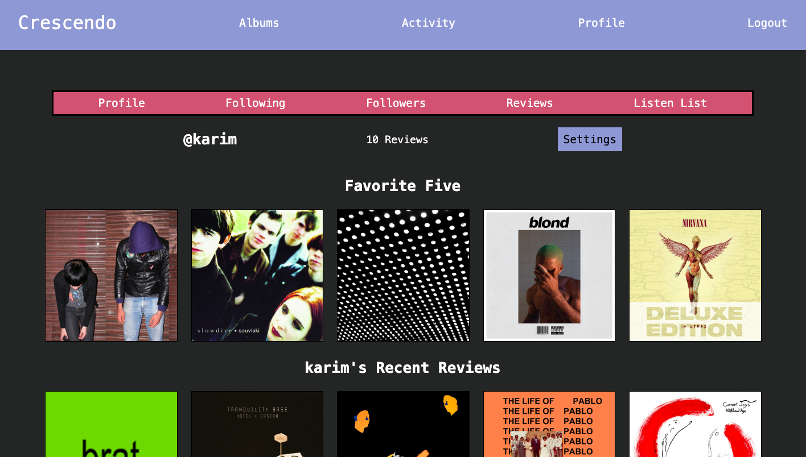

# Crescendo App
Crescendo Music Reviews is a full-stack web application that allows users to view Trending Albums, add reviews to them, or save albums to listen to later. The trending album data is retrieved using the LastFM API, while other album information like track lists, images, and song samples are from the Spotify API. The web application was built using a Node.js and Express.js backend with PostgreSQL to store user data. Controller functions were also tested using the Jest framework. The frontend is built using React and designed responsively for mobile and desktop devices. The project was deployed by writing Docker files for the backend and frontend. It is then tied together with the Docker-Compose file and deployed using a Digital Ocean Droplet. I am still actively working on the web application by adding new features. The current issue I am working on is getting and linking a custom domain name for the website. 

Live App: http://147.182.140.49:3000/

## Features of the App
### Home Page

Users are able to immediately explore or sign up to begin rating albums, or creating a listen list to keep track of new albums to listen to later. 

### Albums Page

Users can check what trending albums are for specific genres on the albums page. The albums displayed utilize LastFM's API to retrieve the highest ranked albums for the requested genre. Users can also use the magnifying glass on the top left to search for specific albums they are looking for. 

### Specific Album Page

Logged in users have the abililty to add or remove albums from their favorite five or listening list on a specific album page. In addition, they can also add a review from 0.5-5 stars. The review will then show up on the activity page, and on the bottom of the current album's page for others to see. 

### Activity Page

Check out and discover new albums by reading recent reviews by other users on the activity page. Each review contains a link to the album page and the user's page to discover more music. 

### User Profile Page

Signed up users can show off their favorite five - a collection of their 5 favorite albums ever. In addition, their profile showcases their recent reviews, listen list, and their following and followers list.

### User Listen List

View any user's current listen list - the collection of albums they intend on listening to and reviewing. 